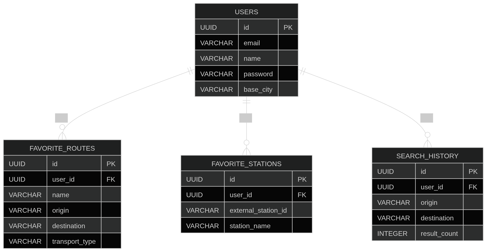

# SwissRoute — API Reference

Backend REST API for planning and tracking public transport trips within Switzerland. Built with Java 21, Spring Boot, and PostgreSQL, SwissRoute acts as a business layer on top of the [Swiss Public Transport API](https://transport.opendata.ch/docs.html).

> **Geographic scope:** All features — connection searches, station lookups, and timetables — rely on `transport.opendata.ch`, which exclusively covers the Swiss public transport network. International routes and stations are not supported.

---

## Table of Contents

- [Problem Statement](#problem-statement)
- [Proposed Solution](#proposed-solution)
- [Project Justification](#project-justification)
- [Technology Stack](#technology-stack)
- [Data Model](#data-model)
- [Database Migrations](#database-migrations)
- [External API Integration](#external-api-integration)
- [Authentication Service](#authentication-service)
  - [Register User](#register-user)
  - [Login User](#login-user)
- [Stations Service](#stations-service)
  - [Search Stations](#search-stations)
- [Connections Service](#connections-service)
  - [Search Connections](#search-connections)
- [Search History](#search-history)
  - [Get Search History](#get-search-history)
  - [Delete History Item](#delete-history-item)
  - [Clear Search History](#clear-search-history)
- [Favorite Routes](#favorite-routes)
  - [Create Favorite Route](#create-favorite-route)
  - [Get Favorite Routes](#get-favorite-routes)
  - [Update Favorite Route](#update-favorite-route)
  - [Delete Favorite Route](#delete-favorite-route)
- [Favorite Stations](#favorite-stations)
  - [Create Favorite Station](#create-favorite-station)
  - [Get Favorite Stations](#get-favorite-stations)
  - [Delete Favorite Station](#delete-favorite-station)
  - [Get Station Board by Favorite Station](#get-station-board-by-favorite-station)
- [Station Board](#station-board)
  - [Get Station Board](#get-station-board)

---

## Problem Statement

Modern public transportation systems generate a large volume of route, schedule, and connection data. Accessing and organizing this information efficiently remains a challenge for many users — travelers often consult multiple platforms to plan routes, verify schedules, and manage preferred trips, resulting in a fragmented experience.

Most public transport APIs also provide raw data without personalized features such as favorite route management, travel history tracking, or centralized trip planning. SwissRoute addresses this by building a robust backend that integrates with the **Swiss Public Transport API** and exposes structured, user-oriented endpoints for authenticated users.

---

## Proposed Solution

SwissRoute is a RESTful backend application built with Java 21, Spring Boot, and PostgreSQL. It enriches external transport data with user management and personalized travel features, providing:

- User authentication and account management via JWT.
- Public transport connection searches between stations.
- Station timetable and departure board consultation.
- Favorite route and station persistence for quick access.
- Automatic history tracking of planned trips.
- Interactive API documentation via Swagger / OpenAPI.

---

## Project Justification

SwissRoute demonstrates modern backend development practices using enterprise-grade technologies: Spring Boot, Spring Data JPA, PostgreSQL, Flyway, and reactive HTTP communication with WebClient. It promotes layered architecture, API-first design, database migration management, and secure user management.

The project provides a strong foundation for future enhancements such as real-time notifications, geolocation support, route optimization, and full frontend integration.

---

## Technology Stack

| Layer                | Technology                  |
|----------------------|-----------------------------|
| Programming Language | Java 21                     |
| Framework            | Spring Boot 3.5.x           |
| Database             | PostgreSQL                  |
| ORM                  | Spring Data JPA / Hibernate |
| Database Migrations  | Flyway                      |
| HTTP Client          | WebClient (Spring WebFlux)  |
| Documentation        | Swagger / OpenAPI 3         |
| Security             | Spring Security + JWT       |
| Build Tool           | Maven                       |
| Containerization     | Docker + Docker Compose     |

---

## Data Model

The following diagram shows the entity-relationship model that underpins all SwissRoute features: user accounts, favorite routes, favorite stations, and connection search history.



### Entities Overview

| Entity              | Description                                                          |
|---------------------|----------------------------------------------------------------------|
| `users`             | Registered platform users. Identified by UUID, email unique.         |
| `favorite_routes`   | User-defined saved routes with origin, destination, transport type.  |
| `favorite_stations` | Stations saved by users, identified by the external station ID.      |
| `search_history`    | Automatically created on each connection search; tied to a user.     |

### Relationships

- A **user** owns zero or more **favorite routes** (one-to-many).
- A **user** owns zero or more **favorite stations** (one-to-many).
- A **user** accumulates zero or more **search history** records (one-to-many).
- All child entities are deleted when the parent user is deleted (cascade).

---

## Database Migrations

SwissRoute uses **Flyway** to manage the database schema. All migration scripts are versioned SQL files located under `src/main/resources/db/migration`, following the naming convention:

```
V{version}__{description}.sql
```

Flyway runs automatically on application startup — no manual steps are required. On first boot, Flyway creates the `flyway_schema_history` table and applies all pending scripts in order. On subsequent startups, only unapplied scripts are executed.

### Migration Script Location

```
src/
└── main/
    └── resources/
        └── db/
            └── migration/
                ├── V1__initial_schema.sql
```

### Rules

> **Never modify or delete an already-applied migration.** Flyway stores a checksum per script. Any change to an applied file causes a checksum mismatch error on startup. To correct or extend past migrations, always create a **new** versioned script.

Every database change must be shipped in the same PR as the feature that requires it, committed separately using the `chore` type:

```bash
git add src/main/resources/db/migration/V5__description.sql
git commit -m "chore: add Flyway migration for <table or change>"
```

---

## External API Integration

SwissRoute integrates with the **Swiss Public Transport API**. No API key is required.

| Property      | Value                                   |
|---------------|-----------------------------------------|
| Base URL      | `https://transport.opendata.ch/v1`      |
| Auth          | None (public API)                       |
| Documentation | https://transport.opendata.ch/docs.html |
| Coverage      | Switzerland only                        |

### Endpoints Used

| External Endpoint   | Purpose in SwissRoute             |
|---------------------|-----------------------------------|
| `GET /locations`    | Search stations by name           |
| `GET /connections`  | Find connections between stations |
| `GET /stationboard` | Get departures from a station     |

### Geographic Scope

The Swiss Public Transport API covers the national transport network within Switzerland:

- 🚆 Trains (SBB/CFF/FFS, regional railways)
- 🚌 Buses (intercity and local lines)
- 🚋 Trams and urban transit
- ⛵ Lake boats
- 🚠 Cable cars and funiculars

Stations, routes, and connections outside Switzerland are not available. Queries for international destinations will return no results or may partially match border stations.

---

## Authentication Service

### Register User

Creates a new user account in the SwissRoute platform.

#### Endpoint

```http
POST /api/users/register
```

#### Access

Public

#### Request Body

```json
{
  "name": "Joe Doe",
  "email": "joedoe@email.com",
  "password": "Password123!",
  "baseCity": "Madrid"
}
```

#### Request Fields

| Field      | Type   | Required | Description                               |
|------------|--------|----------|-------------------------------------------|
| `name`     | String | Yes      | Full name of the user                     |
| `email`    | String | Yes      | Unique user email address                 |
| `password` | String | Yes      | User password following security rules    |
| `baseCity` | String | Yes      | User's default city for travel operations |

#### Password Security Rules

The password must satisfy all of the following:

- Minimum length of 8 characters
- At least one uppercase letter
- At least one lowercase letter
- At least one numeric digit
- At least one special character

Passwords are never stored in plain text. Before persisting the user, the password is hashed using **BCrypt**.

#### Successful Response — 201 Created

```json
{
  "name": "Joe Doe",
  "email": "joedoe@email.com",
  "baseCity": "Madrid",
  "createdAt": "2026-05-20T00:04:05.836Z"
}
```

#### Validation Rules

| Field      | Validation                                         |
|------------|----------------------------------------------------|
| `name`     | Must not be empty                                  |
| `email`    | Must not be empty and must be a valid email format |
| `password` | Must comply with all password security rules       |
| `baseCity` | Must not be empty                                  |

#### Error Responses

**409 — Conflict** — The email is already registered.

```json
{
  "code": 409,
  "name": "CONFLICT",
  "description": "Email is already in use.",
  "timestamp": "2026-05-20T00:04:38.297Z"
}
```

**400 — Bad Request** — One or more required fields are missing or invalid.

```json
{
  "code": 400,
  "name": "BAD_REQUEST",
  "description": "email: Email is required; name: Name is required; password: Password is required; baseCity: Base city is required",
  "timestamp": "2026-05-20T00:05:24.008Z"
}
```

#### Notes

- The email address must be unique across the platform.
- Validation errors are aggregated into a single response message.
- Timestamps are returned in ISO-8601 UTC format.

---

### Login User

Authenticates an existing user and generates a JWT access token.

#### Endpoint

```http
POST /api/users/login
```

#### Access

Public

#### Request Body

```json
{
  "email": "joedoe@email.com",
  "password": "Password123!"
}
```

#### Request Fields

| Field      | Type   | Required | Description                   |
|------------|--------|----------|-------------------------------|
| `email`    | String | Yes      | Registered user email address |
| `password` | String | Yes      | User account password         |

#### Authentication Process

1. The system validates the request payload.
2. The user is looked up by email address.
3. The provided password is compared against the BCrypt-hashed password in the database.
4. If successful, a signed JWT token is generated and returned.

#### Successful Response — 200 OK

```json
{
  "token": "eyJhbGciOiJIUzI1NiJ9...",
  "tokenType": "Bearer",
  "expiresIn": 3600,
  "userId": "d5218cb4-bb57-4ea9-b002-f2e73505d041"
}
```

#### Response Fields

| Field       | Type   | Description                                 |
|-------------|--------|---------------------------------------------|
| `token`     | String | JWT access token                            |
| `tokenType` | String | Authentication scheme (`Bearer`)            |
| `expiresIn` | Number | Token validity in seconds                   |
| `userId`    | UUID   | Unique identifier of the authenticated user |

The token must be sent in the `Authorization` header for all protected endpoints:

```http
Authorization: Bearer <token>
```

#### Validation Rules

| Field      | Validation                                                |
|------------|-----------------------------------------------------------|
| `email`    | Must not be null, empty, and must be a valid email format |
| `password` | Must not be null or empty                                 |

#### Error Responses

**400 — Bad Request** — Required fields are missing or empty.

```json
{
  "code": 400,
  "name": "BAD_REQUEST",
  "description": "password: Password is required; email: Email is required",
  "timestamp": "2026-05-21T00:18:38.544Z"
}
```

**401 — Unauthorized** — Credentials are invalid.

```json
{
  "code": 401,
  "name": "UNAUTHORIZED",
  "description": "Invalid credentials",
  "timestamp": "2026-05-21T00:19:05.308Z"
}
```

#### Notes

- JWT tokens are time-limited and expire automatically after the configured duration.
- Timestamps are returned in ISO-8601 UTC format.

---

## Stations Service

### Search Stations

Returns a list of Swiss public transport stations matching a name query or geographic coordinates.

#### Endpoint

```http
GET /api/stations
```

#### Access

Restricted — Requires a valid JWT token.

#### Authorization

```http
Authorization: Bearer {{JWT}}
```

#### Query Parameters

| Parameter   | Type   | Required    | Description                          |
|-------------|--------|-------------|--------------------------------------|
| `query`     | String | Conditional | Station name or partial station name |
| `latitude`  | Number | Conditional | Latitude coordinate                  |
| `longitude` | Number | Conditional | Longitude coordinate                 |

#### Search Modes

The endpoint supports two exclusive search modes.

**Search by Name**

```http
GET /api/stations?query=Basel
```

**Search by Coordinates**

```http
GET /api/stations?latitude=47.378177&longitude=8.540192
```

#### Parameter Combination Rules

| `query` | `latitude` | `longitude` | Valid |
|---------|------------|-------------|-------|
| ✅      | ❌         | ❌          | Yes   |
| ❌      | ✅         | ✅          | Yes   |
| ✅      | ✅         | ✅          | No    |
| ❌      | ✅         | ❌          | No    |
| ❌      | ❌         | ✅          | No    |
| ❌      | ❌         | ❌          | No    |

#### Coordinate Ranges

| Parameter   | Valid Range               |
|-------------|---------------------------|
| `latitude`  | `-90 ≤ latitude ≤ 90`     |
| `longitude` | `-180 ≤ longitude ≤ 180`  |

#### Successful Response — 200 OK

**Search by Name**

```json
{
  "stations": [
    {
      "id": "8500010",
      "name": "Basel SBB",
      "latitude": 47.547403,
      "longitude": 7.589564
    },
    {
      "id": "8500090",
      "name": "Basel Bad Bf",
      "latitude": 47.567301,
      "longitude": 7.606922
    }
  ]
}
```

**Search by Coordinates** — includes `distance` field.

```json
{
  "stations": [
    {
      "id": null,
      "name": "Hauptbahnhof Zuerich, Zürich",
      "latitude": null,
      "longitude": null,
      "distance": 11
    }
  ]
}
```

#### Response Fields

| Field       | Type   | Description                                  |
|-------------|--------|----------------------------------------------|
| `id`        | String | Unique station identifier (null for coords)  |
| `name`      | String | Official station name                        |
| `latitude`  | Number | Station latitude (null for coords search)    |
| `longitude` | Number | Station longitude (null for coords search)   |
| `distance`  | Number | Distance in meters (only for coords search)  |

#### Error Responses

**400 — Bad Request**

```json
{ "code": 400, "name": "BAD_REQUEST", "description": "At least one search method is required", "timestamp": "..." }
```

```json
{ "code": 400, "name": "BAD_REQUEST", "description": "latitude and longitude must be provided together", "timestamp": "..." }
```

```json
{ "code": 400, "name": "BAD_REQUEST", "description": "Coordinates are out of valid range", "timestamp": "..." }
```

```json
{ "code": 400, "name": "BAD_REQUEST", "description": "Search by query or coordinates, but not both", "timestamp": "..." }
```

**401 — Unauthorized**

```json
{ "code": 401, "name": "UNAUTHORIZED", "description": "Authentication required or token expired", "timestamp": "..." }
```

**404 — Not Found**

```json
{ "code": 404, "name": "NOT_FOUND", "description": "No stations found with the name: sagmade", "timestamp": "..." }
```

**502 — Bad Gateway** — External API rejected the request.

```json
{ "code": 502, "name": "BAD_GATEWAY", "description": "Api Transport rejected the request", "timestamp": "..." }
```

**503 — Service Unavailable** — External API is unreachable.

```json
{ "code": 503, "name": "SERVICE_UNAVAILABLE", "description": "Api Transport is unavailable", "timestamp": "..." }
```

#### Notes

- Only one search mode can be used per request.
- `latitude` and `longitude` must always be provided together.
- `distance` is only present in coordinate-based search results.
- Authentication is mandatory.
- Timestamps are in ISO-8601 UTC format.

---

## Connections Service

### Search Connections

Returns available public transport connections between two stations. Every successful search is automatically persisted in the user's search history.

#### Endpoint

```http
GET /api/connections
```

#### Access

Restricted — Requires a valid JWT token.

#### Authorization

```http
Authorization: Bearer {{JWT}}
```

#### Query Parameters

| Parameter         | Type     | Required | Description                                                        |
|-------------------|----------|----------|--------------------------------------------------------------------|
| `from`            | String   | Yes      | Origin station name                                                |
| `to`              | String   | Yes      | Destination station name                                           |
| `date`            | String   | No       | Travel date in `yyyy-MM-dd` format                                 |
| `time`            | String   | No       | Travel time in `HH:mm` format                                      |
| `transportations` | Enum[]   | No       | Transport type filter (`TRAIN`, `TRAM`, `SHIP`, `BUS`, `CABLEWAY`) |
| `via`             | String   | No       | Intermediate stop (up to 5)                                        |

#### Example Requests

```http
GET /api/connections?from=Lausanne&to=Genève
GET /api/connections?from=Lausanne&to=Genève&date=2026-05-25&time=21:30
GET /api/connections?from=Lausanne&to=Genève&transportations=TRAIN,BUS
```

#### Successful Response — 200 OK

```json
{
  "connections": [
    {
      "origin": "Lausanne",
      "destination": "Genève",
      "duration": "00d00:54:00",
      "products": ["RE33"],
      "sections": [
        {
          "category": "RE",
          "number": "33",
          "operator": "SBB",
          "destination": "Genève-Aéroport",
          "departureStation": "Lausanne",
          "departureTime": "2026-05-25T21:30:00Z",
          "arrivalStation": "Genève",
          "arrivalTime": "2026-05-25T22:24:00Z",
          "platform": "7"
        }
      ]
    }
  ]
}
```

#### Response Fields

**Connection**

| Field         | Type          | Description               |
|---------------|---------------|---------------------------|
| `origin`      | String        | Origin station            |
| `destination` | String        | Destination station       |
| `duration`    | String        | Total connection duration |
| `products`    | Array<String> | Transport products used   |
| `sections`    | Array<Object> | Route segments            |

**Section**

| Field              | Type     | Description                      |
|--------------------|----------|----------------------------------|
| `category`         | String   | Transport category               |
| `number`           | String   | Route or line number             |
| `operator`         | String   | Transport operator               |
| `destination`      | String   | Final destination of the section |
| `departureStation` | String   | Departure station                |
| `departureTime`    | DateTime | Departure time in UTC            |
| `arrivalStation`   | String   | Arrival station                  |
| `arrivalTime`      | DateTime | Arrival time in UTC              |
| `platform`         | String   | Departure platform               |

#### Automatic Search History Persistence

Every successful connection search creates a record in the `search_history` table, associated with the authenticated user.

| Field         | Description                                              |
|---------------|----------------------------------------------------------|
| `user_id`     | Authenticated user identifier from the JWT token         |
| `origin`      | Value of the `from` query parameter                      |
| `destination` | Value of the `to` query parameter                        |
| `resultCount` | Total number of connections returned                     |
| `searchedAt`  | UTC timestamp at the time of the search                  |

#### Validation Rules

| Parameter         | Validation                            |
|-------------------|---------------------------------------|
| `from`            | Must not be null, empty, or blank     |
| `to`              | Must not be null, empty, or blank     |
| `date`            | Must follow `yyyy-MM-dd` format       |
| `time`            | Must follow `HH:mm` format            |
| `transportations` | Only allowed enum values are accepted |

#### Error Responses

**400 — Bad Request**

```json
{ "code": 400, "name": "BAD_REQUEST", "description": "to: Destination station must not be blank; from: Origin station must not be blank", "timestamp": "..." }
```

```json
{ "code": 400, "name": "BAD_REQUEST", "description": "Field 'date': invalid value '2026-05-25-34'", "timestamp": "..." }
```

```json
{ "code": 400, "name": "BAD_REQUEST", "description": "Field 'time': invalid value '23:18:2321'", "timestamp": "..." }
```

```json
{ "code": 400, "name": "BAD_REQUEST", "description": "Field 'transportations': invalid value 'buseta'", "timestamp": "..." }
```

**401 — Unauthorized**

```json
{ "code": 401, "name": "UNAUTHORIZED", "description": "Authentication required or token expired", "timestamp": "..." }
```

**404 — Not Found**

```json
{ "code": 404, "name": "NOT_FOUND", "description": "No connections found for the given parameters", "timestamp": "..." }
```

```json
{ "code": 404, "name": "NOT_FOUND", "description": "user not found", "timestamp": "..." }
```

**502 — Bad Gateway**

```json
{ "code": 502, "name": "BAD_GATEWAY", "description": "Api Transport rejected the request", "timestamp": "..." }
```

**503 — Service Unavailable**

```json
{ "code": 503, "name": "SERVICE_UNAVAILABLE", "description": "Api Transport is unavailable", "timestamp": "..." }
```

#### Notes

- Search history is persisted only for successfully authenticated users.
- The authenticated user must exist in the local database before history can be stored.
- Multiple transportation filters can be combined.
- Date and time parameters default to current system values if omitted.
- All timestamps are in ISO-8601 UTC format.

---

## Search History

### Get Search History

Returns the paginated connection search history of the authenticated user.

#### Endpoint

```http
GET /api/history
```

#### Access

Restricted — Requires a valid JWT token.

#### Authorization

```http
Authorization: Bearer {{JWT}}
```

#### Query Parameters

| Parameter | Type    | Required | Default | Validation                  | Description    |
|-----------|---------|----------|---------|-----------------------------|----------------|
| `page`    | Integer | No       | `1`     | Minimum: `1`                | Page number    |
| `size`    | Integer | No       | `20`    | Minimum: `1`, Maximum: `50` | Items per page |

#### Example Request

```http
GET /api/history?page=1&size=20
```

#### Successful Response — 200 OK

```json
{
  "history": [
    {
      "id": "13fbb325-04cb-41a0-a5aa-9b61f55b66d3",
      "origin": "Lausanne",
      "destination": "Genève",
      "resultCount": 4,
      "searchedAt": "2026-05-25T20:57:38.072Z"
    }
  ],
  "page": 1,
  "size": 20,
  "totalElements": 4,
  "totalPages": 1
}
```

#### Response Fields

**History Item**

| Field         | Type     | Description                           |
|---------------|----------|---------------------------------------|
| `id`          | UUID     | Search history item identifier        |
| `origin`      | String   | Origin station                        |
| `destination` | String   | Destination station                   |
| `resultCount` | Integer  | Total connections returned by the API |
| `searchedAt`  | DateTime | UTC timestamp of the search           |

**Pagination**

| Field           | Type    | Description           |
|-----------------|---------|-----------------------|
| `page`          | Integer | Current page number   |
| `size`          | Integer | Requested page size   |
| `totalElements` | Integer | Total history records |
| `totalPages`    | Integer | Total available pages |

#### Error Responses

**400 — Bad Request** — Pagination parameters are invalid.

```json
{ "code": 400, "name": "BAD_REQUEST", "description": "page: Page must be greater than or equal to 1; size: Size must be less than or equal to 50", "timestamp": "..." }
```

**401 — Unauthorized**

```json
{ "code": 401, "name": "UNAUTHORIZED", "description": "Authentication required or token expired", "timestamp": "..." }
```

**404 — Not Found**

```json
{ "code": 404, "name": "NOT_FOUND", "description": "User not found", "timestamp": "..." }
```

#### Notes

- History is scoped exclusively to the authenticated user.
- Results are returned in descending order by `searchedAt`.
- Pagination starts at page `1`.

---

### Delete History Item

Deletes a specific search history record belonging to the authenticated user.

#### Endpoint

```http
DELETE /api/history/{itemId}
```

#### Access

Restricted — Requires a valid JWT token.

#### Authorization

```http
Authorization: Bearer {{JWT}}
```

#### Path Parameters

| Parameter | Type | Required | Description                    |
|-----------|------|----------|--------------------------------|
| `itemId`  | UUID | Yes      | Search history item identifier |

#### Example Request

```http
DELETE /api/history/13fbb325-04cb-41a0-a5aa-9b61f55b66d3
```

#### Successful Response — 204 No Content

The history item was successfully deleted.

#### Error Responses

**400 — Bad Request** — Path parameter is not a valid UUID.

```json
{ "code": 400, "name": "BAD_REQUEST", "description": "Invalid path parameter for: 'itemId'", "timestamp": "..." }
```

**401 — Unauthorized**

```json
{ "code": 401, "name": "UNAUTHORIZED", "description": "Authentication required or token expired", "timestamp": "..." }
```

**404 — Not Found**

```json
{ "code": 404, "name": "NOT_FOUND", "description": "Item id not found", "timestamp": "..." }
```

#### Notes

- Users can only delete their own history items.
- Deletion is permanent and cannot be undone.

---

### Clear Search History

Permanently deletes all connection search history records for the authenticated user.

#### Endpoint

```http
DELETE /api/history
```

#### Access

Restricted — Requires a valid JWT token.

#### Authorization

```http
Authorization: Bearer {{JWT}}
```

#### Successful Response — 204 No Content

The user's search history was successfully cleared.

#### Error Responses

**401 — Unauthorized**

```json
{ "code": 401, "name": "UNAUTHORIZED", "description": "Authentication required or token expired", "timestamp": "..." }
```

**404 — Not Found**

```json
{ "code": 404, "name": "NOT_FOUND", "description": "User not found", "timestamp": "..." }
```

#### Notes

- Only the authenticated user's history is deleted.
- This operation cannot be undone.

---

## Favorite Routes

### Create Favorite Route

Registers a new favorite route for the authenticated user.

#### Endpoint

```http
POST /api/favorite-routes
```

#### Access

Restricted — Requires a valid JWT token.

#### Authorization

```http
Authorization: Bearer {{JWT}}
```

#### Request Body

```json
{
  "name": "Home to work",
  "origin": "Geneve",
  "destination": "Zurich",
  "transportType": "TRAIN"
}
```

#### Request Fields

| Field           | Type   | Required | Description                            |
|-----------------|--------|----------|----------------------------------------|
| `name`          | String | Yes      | Unique name for this favorite route    |
| `origin`        | String | Yes      | Origin station name                    |
| `destination`   | String | Yes      | Destination station name               |
| `transportType` | Enum   | No       | Transport type: `TRAIN`, `TRAM`, `SHIP`, `BUS`, `CABLEWAY` |

#### Validation Rules

| Field           | Validation                                   |
|-----------------|----------------------------------------------|
| `name`          | Must not be null, empty, or blank            |
| `origin`        | Must not be null, empty, or blank            |
| `destination`   | Must not be null, empty, or blank            |
| `transportType` | Optional; if provided, must be a valid enum  |

#### Successful Response — 201 Created

```json
{
  "id": "028abc30-423b-4b17-8bb8-87647d860b6a",
  "name": "Home to work",
  "origin": "Geneve",
  "destination": "Zurich",
  "transportType": "TRAIN",
  "createdAt": "2026-05-26T23:58:17.137Z"
}
```

#### Response Fields

| Field           | Type     | Description                |
|-----------------|----------|----------------------------|
| `id`            | UUID     | Favorite route identifier  |
| `name`          | String   | Favorite route name        |
| `origin`        | String   | Origin station             |
| `destination`   | String   | Destination station        |
| `transportType` | String   | Transportation type filter |
| `createdAt`     | DateTime | UTC creation timestamp     |

#### Error Responses

**400 — Bad Request**

```json
{ "code": 400, "name": "BAD_REQUEST", "description": "name: Name is required; origin: Origin is required; destination: Destination is required", "timestamp": "..." }
```

```json
{ "code": 400, "name": "BAD_REQUEST", "description": "Field 'transportType': invalid value 'plane'", "timestamp": "..." }
```

**401 — Unauthorized**

```json
{ "code": 401, "name": "UNAUTHORIZED", "description": "Authentication required or token expired", "timestamp": "..." }
```

**404 — Not Found**

```json
{ "code": 404, "name": "NOT_FOUND", "description": "User not found", "timestamp": "..." }
```

**409 — Conflict** — The route name is already taken.

```json
{ "code": 409, "name": "CONFLICT", "description": "Favorite route name already exists", "timestamp": "..." }
```

#### Notes

- Favorite routes are scoped to the authenticated user.
- The `name` field must be unique per user.
- Timestamps are in ISO-8601 UTC format.

---

### Get Favorite Routes

Returns all favorite routes belonging to the authenticated user.

#### Endpoint

```http
GET /api/favorite-routes
```

#### Access

Restricted — Requires a valid JWT token.

#### Authorization

```http
Authorization: Bearer {{JWT}}
```

#### Successful Response — 200 OK

```json
{
  "favoriteRoutes": [
    {
      "id": "5690feae-e7be-4be8-8d79-b52bca6ed0cf",
      "name": "Ruta1",
      "origin": "Geneve",
      "destination": "Zurich",
      "transportType": "TRAIN",
      "createdAt": "2026-05-26T19:22:48.844Z"
    },
    {
      "id": "873f2e86-6ca7-4660-a36d-38c557a9f732",
      "name": "Ruta4",
      "origin": "Geneve",
      "destination": "Zurich",
      "transportType": null,
      "createdAt": "2026-05-26T19:35:11.605Z"
    }
  ]
}
```

#### Response Fields

| Field           | Type     | Description                              |
|-----------------|----------|------------------------------------------|
| `id`            | UUID     | Favorite route identifier                |
| `name`          | String   | Favorite route name                      |
| `origin`        | String   | Origin station                           |
| `destination`   | String   | Destination station                      |
| `transportType` | String   | Transport type filter (nullable)         |
| `createdAt`     | DateTime | UTC creation timestamp                   |

#### Error Responses

**401 — Unauthorized**

```json
{ "code": 401, "name": "UNAUTHORIZED", "description": "Authentication required or token expired", "timestamp": "..." }
```

**404 — Not Found**

```json
{ "code": 404, "name": "NOT_FOUND", "description": "User not found", "timestamp": "..." }
```

#### Notes

- Only routes belonging to the authenticated user are returned.
- Results are ordered by creation date.
- `transportType` may be `null` when no filter was configured.

---

### Update Favorite Route

Updates an existing favorite route belonging to the authenticated user.

#### Endpoint

```http
PUT /api/favorite-routes/{routeId}
```

#### Access

Restricted — Requires a valid JWT token.

#### Authorization

```http
Authorization: Bearer {{JWT}}
```

#### Path Parameters

| Parameter | Type | Required | Description               |
|-----------|------|----------|---------------------------|
| `routeId` | UUID | Yes      | Favorite route identifier |

#### Request Body

```json
{
  "name": "Home to work",
  "origin": "Basilea",
  "destination": "Berna",
  "transportType": "BUS"
}
```

#### Update Rules

- At least one field must be provided.
- Requests with all fields empty or null are rejected.
- Only valid enum values are accepted for `transportType`.
- The route name must remain unique per user.

#### Successful Response — 200 OK

```json
{
  "id": "5690feae-e7be-4be8-8d79-b52bca6ed0cf",
  "name": "Home to work",
  "origin": "Basilea",
  "destination": "Berna",
  "transportType": "BUS",
  "createdAt": "2026-05-26T19:22:48.844Z"
}
```

#### Error Responses

**400 — Bad Request**

```json
{ "code": 400, "name": "BAD_REQUEST", "description": "Invalid path parameter for: 'routeId'", "timestamp": "..." }
```

```json
{ "code": 400, "name": "BAD_REQUEST", "description": "At least one field must be provided for update", "timestamp": "..." }
```

```json
{ "code": 400, "name": "BAD_REQUEST", "description": "Field 'transportType': invalid value 'plane'", "timestamp": "..." }
```

**401 — Unauthorized**

```json
{ "code": 401, "name": "UNAUTHORIZED", "description": "Authentication required or token expired", "timestamp": "..." }
```

**404 — Not Found**

```json
{ "code": 404, "name": "NOT_FOUND", "description": "Favorite route not found", "timestamp": "..." }
```

**409 — Conflict**

```json
{ "code": 409, "name": "CONFLICT", "description": "Favorite route name already exists", "timestamp": "..." }
```

#### Notes

- Users can update only their own favorite routes.
- Partial updates are supported — only provided fields are modified.
- Timestamps are in ISO-8601 UTC format.

---

### Delete Favorite Route

Deletes a favorite route belonging to the authenticated user.

#### Endpoint

```http
DELETE /api/favorite-routes/{routeId}
```

#### Access

Restricted — Requires a valid JWT token.

#### Authorization

```http
Authorization: Bearer {{JWT}}
```

#### Path Parameters

| Parameter | Type | Required | Description               |
|-----------|------|----------|---------------------------|
| `routeId` | UUID | Yes      | Favorite route identifier |

#### Example Request

```http
DELETE /api/favorite-routes/5690feae-e7be-4be8-8d79-b52bca6ed0cf
```

#### Successful Response — 204 No Content

The favorite route was successfully deleted.

#### Error Responses

**400 — Bad Request**

```json
{ "code": 400, "name": "BAD_REQUEST", "description": "Invalid path parameter for: 'routeId'", "timestamp": "..." }
```

**401 — Unauthorized**

```json
{ "code": 401, "name": "UNAUTHORIZED", "description": "Authentication required or token expired", "timestamp": "..." }
```

**404 — Not Found**

```json
{ "code": 404, "name": "NOT_FOUND", "description": "Favorite route not found", "timestamp": "..." }
```

#### Notes

- Users can delete only their own favorite routes.
- Deletion is permanent and cannot be undone.

---

## Favorite Stations

### Create Favorite Station

Adds a station to the authenticated user's list of favorite stations.

#### Endpoint

```http
POST /api/favorite-stations
```

#### Access

Restricted — Requires a valid JWT token.

#### Authorization

```http
Authorization: Bearer {{JWT}}
```

#### Request Body

```json
{
  "externalStationId": "850309",
  "stationName": "Aarau"
}
```

#### Request Fields

| Field               | Type   | Required | Description                                    |
|---------------------|--------|----------|------------------------------------------------|
| `externalStationId` | String | Yes      | External station identifier from Transport API |
| `stationName`       | String | Yes      | Station name                                   |

#### Validation Rules

| Field               | Validation                                                |
|---------------------|-----------------------------------------------------------|
| `externalStationId` | Must not be null, empty, or blank; must be unique per user |
| `stationName`       | Must not be null, empty, or blank                         |

#### Successful Response — 201 Created

```json
{
  "externalStationId": "850309",
  "stationName": "Aarau",
  "createdAt": "2026-05-28T17:18:54.723Z"
}
```

#### Response Fields

| Field               | Type     | Description                 |
|---------------------|----------|-----------------------------|
| `externalStationId` | String   | External station identifier |
| `stationName`       | String   | Station name                |
| `createdAt`         | DateTime | UTC creation timestamp      |

#### Error Responses

**400 — Bad Request**

```json
{ "code": 400, "name": "BAD_REQUEST", "description": "externalStationId: External station id is required; stationName: Station name is required", "timestamp": "..." }
```

**401 — Unauthorized**

```json
{ "code": 401, "name": "UNAUTHORIZED", "description": "Authentication required or token expired", "timestamp": "..." }
```

**404 — Not Found**

```json
{ "code": 404, "name": "NOT_FOUND", "description": "User not found", "timestamp": "..." }
```

**409 — Conflict** — Station already registered as favorite.

```json
{ "code": 409, "name": "CONFLICT", "description": "externalStationId already registered", "timestamp": "..." }
```

#### Notes

- Favorite stations are scoped to the authenticated user.
- Duplicate registrations are not allowed.
- Timestamps are in ISO-8601 UTC format.

---

### Get Favorite Stations

Returns all favorite stations belonging to the authenticated user.

#### Endpoint

```http
GET /api/favorite-stations
```

#### Access

Restricted — Requires a valid JWT token.

#### Authorization

```http
Authorization: Bearer {{JWT}}
```

#### Successful Response — 200 OK

```json
{
  "favoriteStations": [
    {
      "externalStationId": "8430555",
      "stationName": "Aarau",
      "createdAt": "2026-05-28T16:36:08.181Z"
    },
    {
      "externalStationId": "8503059",
      "stationName": "Olten",
      "createdAt": "2026-05-28T16:35:45.563Z"
    }
  ]
}
```

#### Response Fields

| Field               | Type     | Description                 |
|---------------------|----------|-----------------------------|
| `externalStationId` | String   | External station identifier |
| `stationName`       | String   | Station name                |
| `createdAt`         | DateTime | UTC creation timestamp      |

#### Error Responses

**401 — Unauthorized**

```json
{ "code": 401, "name": "UNAUTHORIZED", "description": "Authentication required or token expired", "timestamp": "..." }
```

**404 — Not Found**

```json
{ "code": 404, "name": "NOT_FOUND", "description": "User not found", "timestamp": "..." }
```

#### Notes

- Only stations belonging to the authenticated user are returned.
- Results are ordered by creation date.

---

### Delete Favorite Station

Deletes a favorite station belonging to the authenticated user.

#### Endpoint

```http
DELETE /api/favorite-stations/{externalStationId}
```

#### Access

Restricted — Requires a valid JWT token.

#### Authorization

```http
Authorization: Bearer {{JWT}}
```

#### Path Parameters

| Parameter           | Type   | Required | Description                 |
|---------------------|--------|----------|-----------------------------|
| `externalStationId` | String | Yes      | External station identifier |

#### Example Request

```http
DELETE /api/favorite-stations/850309
```

#### Successful Response — 204 No Content

The favorite station was successfully deleted.

#### Error Responses

**400 — Bad Request**

```json
{ "code": 400, "name": "BAD_REQUEST", "description": "Invalid path parameter for: 'externalStationId'", "timestamp": "..." }
```

**401 — Unauthorized**

```json
{ "code": 401, "name": "UNAUTHORIZED", "description": "Authentication required or token expired", "timestamp": "..." }
```

**404 — Not Found**

```json
{ "code": 404, "name": "NOT_FOUND", "description": "Favorite station not found", "timestamp": "..." }
```

#### Notes

- Users can delete only their own favorite stations.
- Deletion is permanent and cannot be undone.

---

### Get Station Board by Favorite Station

Returns upcoming departures for a station previously registered as a favorite by the authenticated user.

#### Endpoint

```http
GET /api/favorite-stations/{externalStationId}/station-board
```

#### Access

Restricted — Requires a valid JWT token.

#### Authorization

```http
Authorization: Bearer {{JWT}}
```

#### Path Parameters

| Parameter           | Type   | Required | Description                 |
|---------------------|--------|----------|-----------------------------|
| `externalStationId` | String | Yes      | Favorite station identifier |

#### Example Request

```http
GET /api/favorite-stations/8503059/station-board
```

#### Successful Response — 200 OK

```json
{
  "stationBoards": [
    {
      "serviceName": "008978",
      "category": "S",
      "destinationName": "Zofingen",
      "departureTime": "2026-05-29T19:01:00Z"
    },
    {
      "serviceName": "002189",
      "category": "IR",
      "destinationName": "Zürich HB",
      "departureTime": "2026-05-29T19:15:00Z"
    }
  ]
}
```

#### Response Fields

| Field             | Type     | Description                            |
|-------------------|----------|----------------------------------------|
| `serviceName`     | String   | Service identifier                     |
| `category`        | String   | Service category (IC, IR, RE, S, etc.) |
| `destinationName` | String   | Final destination                      |
| `departureTime`   | DateTime | Scheduled departure time in UTC        |

#### Error Responses

**400 — Bad Request**

```json
{ "code": 400, "name": "BAD_REQUEST", "description": "Invalid path parameter for: 'externalStationId'", "timestamp": "..." }
```

**401 — Unauthorized**

```json
{ "code": 401, "name": "UNAUTHORIZED", "description": "Authentication required or token expired", "timestamp": "..." }
```

**404 — Not Found**

```json
{ "code": 404, "name": "NOT_FOUND", "description": "Station board not found", "timestamp": "..." }
```

**502 — Bad Gateway**

```json
{ "code": 502, "name": "BAD_GATEWAY", "description": "Api Transport rejected the request", "timestamp": "..." }
```

**503 — Service Unavailable**

```json
{ "code": 503, "name": "SERVICE_UNAVAILABLE", "description": "Api Transport is unavailable", "timestamp": "..." }
```

#### Notes

- Only stations registered as favorites by the authenticated user can be queried.
- Departure times are returned in UTC format.
- Results come from the external Swiss Public Transport API.

---

## Station Board

### Get Station Board

Returns upcoming departures for any station, queried directly via filters.

#### Endpoint

```http
GET /api/station-board
```

#### Access

Restricted — Requires a valid JWT token.

#### Authorization

```http
Authorization: Bearer {{JWT}}
```

#### Query Parameters

| Parameter        | Type       | Required | Description                            |
|------------------|------------|----------|----------------------------------------|
| `station`        | String     | Yes      | Station name                           |
| `id`             | String     | No       | Station identifier                     |
| `limit`          | Integer    | No       | Maximum number of departures to return |
| `transportTypes` | List<Enum> | No       | Transport type filter                  |

Supported `transportTypes` values: `TRAIN`, `TRAM`, `SHIP`, `BUS`, `CABLEWAY`.

#### Example Requests

```http
GET /api/station-board?station=Aarau
GET /api/station-board?station=Aarau&limit=10
GET /api/station-board?station=Aarau&transportTypes=TRAIN,BUS
```

#### Successful Response — 200 OK

```json
{
  "stationBoards": [
    {
      "serviceName": "008978",
      "category": "S",
      "destinationName": "Zofingen",
      "departureTime": "2026-05-29T19:01:00Z"
    },
    {
      "serviceName": "008680",
      "category": "S",
      "destinationName": "Olten",
      "departureTime": "2026-05-29T19:08:00Z"
    },
    {
      "serviceName": "002189",
      "category": "IR",
      "destinationName": "Zürich HB",
      "departureTime": "2026-05-29T19:15:00Z"
    }
  ]
}
```

#### Response Fields

| Field             | Type     | Description                     |
|-------------------|----------|---------------------------------|
| `serviceName`     | String   | Service identifier              |
| `category`        | String   | Service category                |
| `destinationName` | String   | Final destination               |
| `departureTime`   | DateTime | Scheduled departure time in UTC |

#### Validation Rules

| Parameter        | Validation                              |
|------------------|-----------------------------------------|
| `station`        | Required and cannot be blank            |
| `limit`          | Must be greater than 0                  |
| `transportTypes` | Must contain only supported enum values |

#### Error Responses

**400 — Bad Request**

```json
{ "code": 400, "name": "BAD_REQUEST", "description": "station: Station is required", "timestamp": "..." }
```

```json
{ "code": 400, "name": "BAD_REQUEST", "description": "Field 'transportTypes': invalid value 'plane'", "timestamp": "..." }
```

```json
{ "code": 400, "name": "BAD_REQUEST", "description": "limit: must be greater than 0", "timestamp": "..." }
```

**401 — Unauthorized**

```json
{ "code": 401, "name": "UNAUTHORIZED", "description": "Authentication required or token expired", "timestamp": "..." }
```

**404 — Not Found**

```json
{ "code": 404, "name": "NOT_FOUND", "description": "Station board not found", "timestamp": "..." }
```

**502 — Bad Gateway**

```json
{ "code": 502, "name": "BAD_GATEWAY", "description": "Api Transport rejected the request", "timestamp": "..." }
```

**503 — Service Unavailable**

```json
{ "code": 503, "name": "SERVICE_UNAVAILABLE", "description": "Api Transport is unavailable", "timestamp": "..." }
```

#### Notes

- Results are retrieved from the Swiss Public Transport API and sorted by departure time.
- `limit` controls the maximum number of departures returned.
- Transportation filters are optional and may be combined.
- Departure times are in ISO-8601 UTC format.
